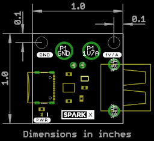

SparkX USB Current Sensor
========================================

[*SparkX USB Current Sensor (SPX-18016)*](https://www.sparkfun.com/products/18016)

Do you want to be able to measure what current your board is drawing in real time? Maybe it is a board that draws short bursts of current?
Or maybe you want to investigate what in-rush current your board draws? If so, this is the product for you!

The TI INA290 is an ultra-precise current sense amplifier that can measure voltage drops across shunt resistors over a wide common-mode range.
The INA290A1 on our board has a gain of 20 Volts per Volt and we measure the current using a 0.05 Ohm shunt resistor. Together these produce an
output of 1 Volt per Amp. If your board is drawing 100mA, you will see an output of 100mV. The maximum current it can measure is 2 Amps
and we've included a 2A resettable fuse for added protection.

We've provided both 0.1" breakout pads and Gator pads, to make it easy to connect up your multimeter or oscilloscope.
Feed power in via the USB-C socket, and provide power to your board via the USB-A socket.
A pair of [USB 2.0 A to C Cables](https://www.sparkfun.com/products/15092) will allow you to connect the input to your USB port or power supply
and the output to your board.
You might find our [BNC to Alligator Cable](https://www.sparkfun.com/products/504) useful for connecting to your oscilloscope.
Our [Banana to Alligator Coax Cable](https://www.sparkfun.com/products/508) is perfect for connecting your multimeter.

Repository Contents
-------------------
* **/Documents** - datasheets etc.
* **/Hardware** - Eagle design files (.brd, .sch)

Product Versions
----------------
* [SPX-18016](https://www.sparkfun.com/products/18016) - Original SparkX Release.

License Information
-------------------

This product is _**open source**_!

Please review the LICENSE.md file for license information.

If you have any questions or concerns on licensing, please contact technical support on our [SparkFun forums](https://forum.sparkfun.com/viewforum.php?f=152).

Distributed as-is; no warranty is given.

- Your friends at SparkFun.
